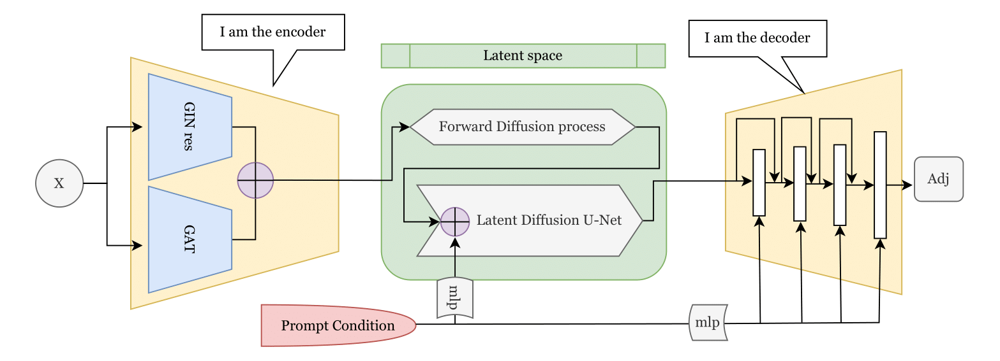

# Graph Generation with Specified Properties

In recent years, there has been an increasing interest in generating graphs given specified properties, being an area that finds applications ranging from chemo-informatics to social networks and infrastructure modeling. The complexity and high-dimensional nature of graph properties make graph generation a particularly challenging problem in machine learning. This project explores **conditional graph generation using latent diffusion models**. By conditioning the generation process on graph properties extracted from textual descriptions, the goal is to produce graphs that accurately match with the specified characteristics.

Our work was largely based on the article *Neural Graph Generator: Feature-Conditioned Graph Generation using Latent Diffusion Models* by [Evdaimon, Nikolentzos et al.](https://arxiv.org/abs/2403.01535), 2024.

For more detail on our work, check the document `report-accrographes.pdf`.

## Model

## **Acknowledgments**

This project was developed as part of a course project from the MVA Master at ENS Paris-Saclay: Advanced Learning for Text and Graph Data taught by Professor Vazirgiannis, 2024. It was also part of the [Kaggle competition on generating graphs with specified properties](https://www.kaggle.com/competitions/generating-graphs-with-specified-properties).

## References

- Iakovos Evdaimon, Giannis Nikolentzos, Christos Xypolopoulos, Ahmed Kammoun, Michail Chatzianastasis, Hadi Abdine, and Michalis Vazirgiannis. *Neural Graph Generator: Feature-Conditioned Graph Generation using Latent Diffusion Models*, 2024. Available at: [https://arxiv.org/abs/2403.01535](https://arxiv.org/abs/2403.01535).
